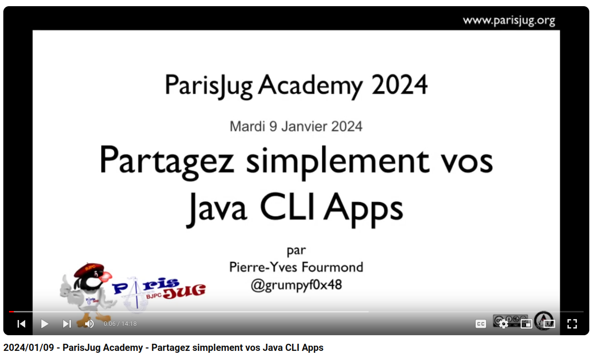

# :floppy_disk: Partagez simplement vos Java CLI Apps

## Talk présenté à la [Paris JUG Academy](https://www.parisjug.org/events/2024/01-09-young-blood-11/) le 9 janvier 2024

[Slides](https://java-cli-apps.github.io/)

[Slides Annexes](https://java-cli-apps.github.io/Annexes.html)

## Exemples de code

### Exemple d'utilisation de la JEP 458

Un exemple basique d'[utilisation de la JEP 458](exemples/jep-458/README.md) (Launch Multi-File Source-Code Programs) qui étend la
[JEP 330](https://openjdk.org/jeps/330) (Launch Single-File Source-Code Programs) et permet de charger les classes
utilisées par la classe lancée sur la ligne de commande.

### Exemple du talk

L'exemple de code du talk qui utilise [Java 21](exemples/generate-data-21/README.md) et dans lequel tout le code source
se trouve dans le même fichier.

### Exemple du talk avec Java 22

Le même exemple avec [Java 22](exemples/generate-data-22/README.md) qui permet de déclarer chaque classe dans un fichier
séparé ([JEP 458](https://openjdk.org/jeps/458)).
