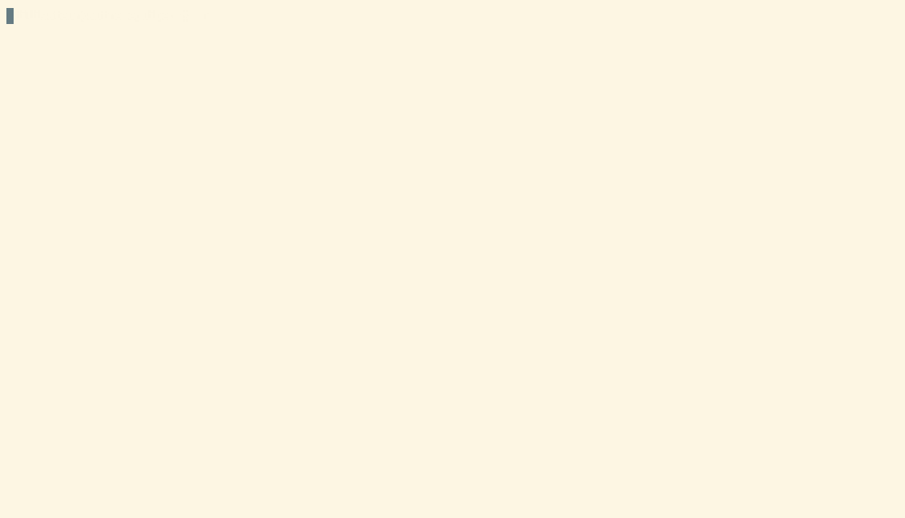

# Exemple d'application en commande ligne avec Java 21

Un programme Java en ligne de commande pour générer des données de test à destination d'une table PostgreSQL.

Ce programme utilise Java 21 et les JEPs suivantes :

- JEP 330: Launch Single-File Source-Code Programs
- JEP 430: String Templates (Preview)
- JEP 441: Pattern Matching for switch
- JEP 443: Unnamed Patterns and Variables (Preview)
- JEP 445: Unnamed Classes and Instance Main Methods (Preview)

Le `Makefile` définit les cibles suivantes :

- test
- package
- install
- test-install

Vous pouvez :

- Utiliser les cibles du `Makefile`
- Saisir les commandes des cibles dans un terminal
- Lancer les commandes depuis le `README.md` avec IDEA

## Tester depuis ce dépot Git


```bash
APP_DIR=. ./GenerateData.java \
	--column id::random \
	--column numero_client::file::clients.txt \
	--column montant::random \
	--count 10 \
	create_table.sql
```

```console
INSERT INTO commandes (id, numero_client, date_commande, montant)
VALUES
('d7df38cd-ef7a-4f1d-ade1-2eb35c5fb0c7', '10850', null, 450),
('a76f648c-fd83-4a2f-864e-409c1633a793', '11204', null, 150),
('01a3a2f0-7790-42e1-827e-537c40d16aca', '12311', null, 400),
('9b01651d-a632-48a2-b629-e6adc8fd59f9', '12355', null, 150),
('6c459800-01c4-445e-bc32-65728b5567ff', '12714', null, 400),
('38a68b11-f97f-4298-a871-67313d5e5ce9', '13011', null, 200),
('90ba3553-a342-44c7-8df3-ca667d05fabe', '13256', null, 150),
('a5a459c5-1df3-4dfc-9e35-94ff364d524a', '13394', null, 250),
('a212f678-ff53-44d8-ae93-bd6a927a8889', '13433', null, 450),
('a4052e27-6f56-4567-b297-71c5729bdcdb', '14405', null, 300);
```

## Packager l'application

```bash
make package
```

```console
rm --force --recursive build
mkdir --parents build/generate-data build/generate-data/scripts build/generate-data/bin build/generate-data/lib
cp GenerateData.java build/generate-data/scripts
cp GenerateData.sh build/generate-data/bin
cp --recursive lib/ build/generate-data
cd build && zip --recurse-paths GenerateData.zip generate-data/
  adding: generate-data/ (stored 0%)
  adding: generate-data/scripts/ (stored 0%)
  adding: generate-data/scripts/GenerateData.java (deflated 76%)
  adding: generate-data/lib/ (stored 0%)
  adding: generate-data/lib/commons-lang3-3.14.0.jar (deflated 10%)
  adding: generate-data/lib/picocli-4.7.5.jar (deflated 7%)
  adding: generate-data/bin/ (stored 0%)
  adding: generate-data/bin/GenerateData.sh (deflated 42%)
```

## Installer l'application

```bash
unzip -d $HOME build/GenerateData.zip
```

```console
Archive:  build/GenerateData.zip
creating: /home/user/generate-data/
creating: /home/user/generate-data/scripts/
inflating: /home/user/generate-data/scripts/GenerateData.java  
creating: /home/user/generate-data/lib/
inflating: /home/user/generate-data/lib/commons-lang3-3.14.0.jar  
inflating: /home/user/generate-data/lib/picocli-4.7.5.jar  
creating: /home/user/generate-data/bin/
inflating: /home/user/generate-data/bin/GenerateData.sh  
```

## Tester l'application installée



```bash
export PATH=$HOME/generate-data/bin:$PATH
```

Puis :

```bash
GenerateData.sh --help
```

ou bien :

```bash
PATH=$HOME/generate-data/bin:$PATH GenerateData.sh --help
```

```console
Usage: GenerateData [-hV] [-n=<lineCount>] [-c=<columnMappings>]...
                    <sqlRequestFile>
      <sqlRequestFile>      The file containing the SQL create table request
  -c, --column=<columnMappings>
                            Map a column with a fixed value, mapping function
                              or value from a file
  -h, --help                Show this help message and exit.
  -n, --count=<lineCount>   Number of lines to generate
  -V, --version             Print version information and exit.
```
